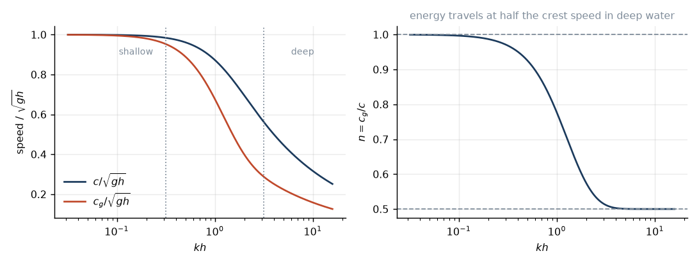

# 1. The water wave problem

We want the equation that says how fast a wave of a given wavelength travels.
Everything downstream depends on it, so let us get it honestly.

## What we are allowed to assume

Three assumptions, and they are all better than they sound.

**Incompressible.** The speed of sound in water is 1500 m/s and our waves move
at 20. Nothing here compresses anything. So $\nabla\cdot\mathbf u = 0$.

**Inviscid.** Seawater has a kinematic viscosity of about $10^{-6}$ m²/s. For a
ten-second wave the Reynolds number is around $10^9$. Viscosity matters in a
boundary layer a few millimetres thick at the bottom, and in the whitecaps, and
nowhere else. We will drop it, and in lesson 6 we will find out that this was
almost embarrassingly justified — swell crosses the Pacific losing barely a
tenth of its energy.

**Irrotational.** This one is a gift from Kelvin. If a fluid is inviscid and
starts from rest, the circulation round any material loop is conserved, so if
the vorticity is zero once it is zero forever. Water at rest has no vorticity.
Therefore $\nabla\times\mathbf u = 0$.

That last one is worth more than the other two combined, because a curl-free
field is a gradient:

$$\mathbf u = \nabla\phi.$$

One scalar instead of three components. And feeding it into incompressibility:

$$\boxed{\nabla^2\phi = 0}$$

Laplace's equation. The most boring equation in physics.

Look at what has happened. The governing equation is linear, elliptic, and
completely devoid of interesting behaviour. It has no time in it. It cannot
oscillate. And yet we are about to get waves out of it. Where do they come
from?

From the boundary. All of the physics of water waves lives in the boundary
conditions, and specifically in the free surface, which is a boundary that
moves — and whose motion is what we are trying to solve for. Hold on to that.
It is the whole difficulty.

## Setting up

Let $z$ point up, $z=0$ be the undisturbed surface, $z=\eta(x,y,t)$ be the
actual surface, and $z=-h$ be the bottom.

Before the boundary conditions we need pressure, and for that we need Euler's
equation. It is just $F=ma$ for a blob of fluid, so let us write it out.

**The $ma$.** Take a small parcel of volume $\delta V$, so its mass is
$\rho\,\delta V$. Its acceleration is the awkward part. The velocity field
$\mathbf u(\mathbf x, t)$ is a function of position, but the parcel is
*moving*, so its velocity changes for two reasons: the field itself changes in
time, and the parcel arrives somewhere the field is different. Following the
parcel along its path $\mathbf x(t)$ and using the chain rule,

$$\frac{d}{dt}\mathbf u(\mathbf x(t),t)
= \frac{\partial\mathbf u}{\partial t}
+ \frac{d\mathbf x}{dt}\cdot\nabla\mathbf u
= \underbrace{\frac{\partial\mathbf u}{\partial t}
+ (\mathbf u\cdot\nabla)\mathbf u}_{\textstyle \frac{D\mathbf u}{Dt}}.$$

The second term is there because we insisted on describing the fluid by a field
at fixed points while Newton insists on talking about parcels. It is called the
material derivative, and note that it is *nonlinear* in $\mathbf u$ — this
single term is the source of essentially every hard problem in fluid mechanics,
turbulence included. It is also the term we are going to throw away in a few
paragraphs.

**The $F$.** Two forces act on the parcel. Gravity, $-\rho g\,\delta V\,
\hat{\mathbf z}$. And pressure, pushing inwards on every face. Take the parcel
to be a box and look at the two faces perpendicular to $x$: the one at $x$ is
pushed in the $+x$ direction with force $p(x)\,\delta y\,\delta z$, the one at
$x+\delta x$ is pushed back with $p(x+\delta x)\,\delta y\,\delta z$. The net is

$$-\frac{\partial p}{\partial x}\,\delta x\,\delta y\,\delta z
= -\frac{\partial p}{\partial x}\,\delta V,$$

and the same on the other two axes. So pressure contributes $-\nabla p$ per
unit volume. Uniform pressure does nothing; only a *gradient* pushes.

Put them together, divide by $\rho\,\delta V$:

$$\boxed{\ \frac{\partial\mathbf u}{\partial t} + (\mathbf u\cdot\nabla)\mathbf u
= -\frac{1}{\rho}\nabla p - g\hat{\mathbf z}\ }$$

That is Euler's equation. Had we kept viscosity there would be a $\nu\nabla^2
\mathbf u$ on the right and it would be Navier–Stokes; we argued above that for
a ten-second ocean wave that term is nine orders of magnitude down, so out it
goes.

Now use the identity $(\mathbf u\cdot\nabla)\mathbf u
= \nabla(\tfrac12|\mathbf u|^2) - \mathbf u\times(\nabla\times\mathbf u)$. The
second term dies by irrotationality. Everything left is a gradient, so we can
integrate the whole equation once:

$$\frac{\partial\phi}{\partial t} + \frac12|\nabla\phi|^2
+ \frac{p-p_{\rm atm}}{\rho} + gz = 0. \tag{1.1}$$

This is Bernoulli's equation with the unsteady term kept. (An arbitrary
function of time appears on the right; absorb it into $\phi$, which is defined
only up to such a thing anyway.)

## Three boundary conditions

**At the bottom**, water does not go through rock:

$$\frac{\partial\phi}{\partial z} = 0 \qquad\text{at } z=-h. \tag{1.2}$$

**At the surface, kinematically.** This one deserves care, because it is where
the moving boundary first bites.

The physical statement is that the free surface is a *material* surface: it is
made of water, and it is made of the same water from one moment to the next.
A particle sitting on the surface stays on the surface. It never crosses to the
inside, and it never leaves — if it did, either the sea would be leaking into
the air or the surface would have torn, and neither is allowed in this model.
(This is exactly the assumption that fails when a wave breaks and throws a jet
of water off the crest into free flight, which is why lesson 10 needs a
different kind of argument.)

To turn that into an equation, define

$$F(x,y,z,t) = z - \eta(x,y,t),$$

so that $F=0$ *is* the surface, $F>0$ is air and $F<0$ is water. Now "a surface
particle stays on the surface" reads: the value of $F$ carried by that particle
never changes. Following the particle means the material derivative from the
Euler section, so

$$\frac{DF}{Dt} = \frac{\partial F}{\partial t}
+ (\mathbf u\cdot\nabla)F = 0.$$

Work out the two pieces. Since $z$ carries no explicit time dependence, only
$\eta$ contributes to the first:

$$\frac{\partial F}{\partial t} = -\frac{\partial\eta}{\partial t}.$$

And the gradient of $F$, taking the derivative of $z$ with respect to $z$ to be
1, is

$$\nabla F = \left(-\frac{\partial\eta}{\partial x},\;
-\frac{\partial\eta}{\partial y},\; 1\right),$$

so with $\mathbf u = (u,v,w)$,

$$(\mathbf u\cdot\nabla)F
= -u\frac{\partial\eta}{\partial x} - v\frac{\partial\eta}{\partial y} + w.$$

Add them, set the sum to zero, and flip the signs:

$$\frac{\partial\eta}{\partial t}
+ u\frac{\partial\eta}{\partial x}
+ v\frac{\partial\eta}{\partial y}
= w
\qquad\text{at } z=\eta.$$

Finally substitute $\mathbf u = \nabla\phi$:

$$\frac{\partial\eta}{\partial t}
+ \frac{\partial\phi}{\partial x}\frac{\partial\eta}{\partial x}
+ \frac{\partial\phi}{\partial y}\frac{\partial\eta}{\partial y}
= \frac{\partial\phi}{\partial z}
\qquad\text{at } z=\eta. \tag{1.3}$$

Nothing has been approximated yet — (1.3) is exact.

Two ways to read it. Geometrically, $\nabla F$ points along the surface normal,
so the condition says the fluid's normal velocity equals the surface's own
normal velocity: the water keeps up with the interface exactly, neither
outrunning it nor falling behind.

More concretely, in one dimension it is $\partial_t\eta = w - u\,\partial_x\eta$.
The surface at a fixed $x$ rises for two reasons — water moving up, and water
moving *sideways along a slope*. Stand at one spot as a wave approaches: some
of the rise under your feet is water lifting, and some is simply the upslope
face of the wave being carried past you. It is the material derivative again,
in the same two pieces.

And notice the nuisance: (1.3) is nonlinear, because $u$ multiplies
$\partial_x\eta$ and both are unknowns, and it must be imposed at $z=\eta$,
which we also do not know. That is the difficulty we buy our way out of in the
next section.

**At the surface, dynamically.** The pressure just under the surface equals the
atmospheric pressure just above it. (We are ignoring surface tension, which is
fine: it only competes with gravity for wavelengths below about 1.7 cm.) Put
$p = p_{\rm atm}$ into (1.1):

$$\frac{\partial\phi}{\partial t} + \frac12|\nabla\phi|^2 + g\eta = 0
\qquad\text{at } z=\eta. \tag{1.4}$$

Now stare at (1.3) and (1.4) and notice how bad they are. They are nonlinear,
they are coupled, and — worst — they are imposed at $z=\eta$, a location we do
not know until we have solved the problem. This is why water waves were still
producing new mathematics a century after Stokes.

## Linearising

We escape by assuming the waves are gentle. Let $a$ be the amplitude, $k$ the
wavenumber, and

$$\epsilon = ka \ll 1$$

the steepness. A ten-second wave is 156 m long; if it is 2 m high then
$a=1$ m and $\epsilon = 0.04$. Small. Even a nasty storm sea rarely exceeds
$\epsilon \approx 0.1$, and at $\epsilon\approx 0.44$ the wave breaks and there
is no point in theory anyway. So $\epsilon$ is a genuinely small parameter over
the entire range we care about.

### Getting the scales straight

Before throwing anything away we should be able to say, term by term, *how*
small it is. That needs an estimate of the size of each quantity, and there are
only four scales in the problem.

The surface height is $\eta\sim a$, by definition of the amplitude, and the
time scale is $1/\omega$.

The horizontal length scale is $1/k$, also by definition. The vertical scale is
$1/k$ **as well**, and this is the one worth pausing on, because it is not an
assumption — Laplace's equation forces it. Put $\phi \sim Z(z)e^{ikx}$ into
$\nabla^2\phi = 0$ and you get $Z'' = k^2Z$, whose solutions are $e^{\pm kz}$.
So the only vertical scale available is $1/k$: a wave 156 m long stirs the
water to a depth of order 25 m and no deeper, and a ripple 2 cm long stirs it
to a few millimetres. **Every $\partial/\partial z$ therefore brings down a
factor of $k$**, and so does every $\partial/\partial x$. Hold on to that; it
is the whole engine of the estimate.

The velocity follows. A water particle traces an orbit of radius $\sim a$ once
per period, so

$$|\mathbf u| \sim a\omega .$$

And since $\mathbf u = \nabla\phi$ and the gradient contributes a factor $k$,

$$\phi \sim \frac{a\omega}{k}.$$

That is everything we need. Now the bookkeeping is three one-line checks, and
they all return the same answer.

**The quadratic term in Bernoulli.** Compare the two terms in (1.4):

$$\frac{\tfrac12|\nabla\phi|^2}{\partial\phi/\partial t}
\sim \frac{(a\omega)^2}{\omega\cdot a\omega/k}
= ak = \epsilon .$$

**The convective term in the kinematic condition.** Compare the two terms
in (1.3):

$$\frac{u\,\partial\eta/\partial x}{\partial\eta/\partial t}
\sim \frac{(a\omega)(ak)}{a\omega} = ak = \epsilon .$$

Which is the same statement as before in different clothes: the material
derivative's second piece is $\epsilon$ times its first. Following the parcel
barely differs from watching the point, and now we know by how much.

**The Taylor correction.** Here is the one you asked about. Expanding about the
mean surface,

$$\left.\frac{\partial\phi}{\partial z}\right|_{z=\eta}
= \left.\frac{\partial\phi}{\partial z}\right|_{z=0}
+ \eta\left.\frac{\partial^2\phi}{\partial z^2}\right|_{z=0} + \cdots$$

the correction differs from the leading term by one factor of $\eta$ and one
extra $\partial/\partial z$. The first supplies an $a$, the second supplies a
$k$, so

$$\frac{\eta\,\partial^2\phi/\partial z^2}{\partial\phi/\partial z}
\sim ak = \epsilon .$$

That is the general rule, and it is worth stating on its own: **each further
term in the expansion costs one factor of $\epsilon$**, because each one trades
a power of $\eta$ (worth $a$) against a $z$-derivative (worth $k$). The series
is an expansion in $ka$, and evaluating at $z=0$ instead of $z=\eta$ is simply
truncating it at first order.

### Doing it

With the scales established, the two simplifications are now justified rather
than asserted. Drop everything of relative order $\epsilon$: the quadratic
terms go, and the surface conditions may be imposed at $z=0$ instead of
$z=\eta$.

The moving boundary has become a fixed one. That is the whole content of linear
wave theory, and it is why the theory works so well: not because the waves are
small in any absolute sense, but because we only ever needed the *boundary* to
be nearly flat.

What is left is embarrassingly simple:

$$\frac{\partial\eta}{\partial t} = \frac{\partial\phi}{\partial z},
\qquad
\frac{\partial\phi}{\partial t} + g\eta = 0,
\qquad\text{both at } z=0. \tag{1.5}$$

Differentiate the second in time, substitute the first, and the surface
elevation disappears entirely:

$$\frac{\partial^2\phi}{\partial t^2} + g\frac{\partial\phi}{\partial z} = 0
\qquad\text{at } z=0. \tag{1.6}$$

One equation, one unknown. Now we can solve.

## Solving

Look for a wave running in $+x$:

$$\eta = a\cos(kx-\omega t), \qquad \phi = \Phi(z)\sin(kx-\omega t).$$

Laplace's equation becomes an ordinary differential equation,

$$\Phi'' - k^2\Phi = 0
\quad\Longrightarrow\quad
\Phi = A\cosh kz + B\sinh kz.$$

The bottom condition $\Phi'(-h)=0$ gives $B = A\tanh kh$, and with a little
hyperbolic bookkeeping,

$$\Phi(z) = C\cosh k(z+h),$$

which is nicer: the vertical structure is a cosh measured up from the seabed.
Fix $C$ from the second of (1.5), $\eta = -g^{-1}\partial_t\phi|_{z=0}$:

$$\phi = \frac{ag}{\omega}\,\frac{\cosh k(z+h)}{\cosh kh}\,\sin(kx-\omega t).
\tag{1.7}$$

And now put (1.7) into the combined condition (1.6). The trigonometry cancels,
leaving $-\omega^2\cosh kh + gk\sinh kh = 0$, that is

$$\boxed{\ \omega^2 = gk\tanh kh\ } \tag{1.8}$$

There it is. The dispersion relation for surface gravity waves. Everything in
the next ten lessons is a consequence of this one line.

## What it says

The frequency is not proportional to the wavenumber. That is the entire point,
and the word for it is *dispersion*: different wavelengths travel at different
speeds, so a pulse made of many wavelengths falls apart as it travels. Light in
glass does this weakly; the ocean does it violently.

Two limits matter, and the $\tanh$ decides which one you are in.

**Deep water**, $kh \gg 1$, so $\tanh kh \to 1$:

$$\omega^2 = gk.$$

The depth has dropped out. A wave in deep water does not know the bottom
exists — and this is the regime for essentially the entire journey from storm
to coast. In practice $\tanh kh$ is within 0.4% of 1 by $kh=\pi$, so "deep"
means $h > L/2$. For a 15 s swell, $L=351$ m, so deep water means deeper than
176 m. Most continental shelves are shallower than that, which is a hint about
where things start to get interesting.

**Shallow water**, $kh\ll 1$, so $\tanh kh\to kh$:

$$\omega^2 = gk^2h \quad\Longrightarrow\quad \omega = k\sqrt{gh}.$$

Now $\omega$ *is* proportional to $k$, so all wavelengths travel at
$\sqrt{gh}$ and there is no dispersion at all. This is the tsunami regime, and
also the surf zone. The conventional boundary is $kh < \pi/10$, i.e.
$h < L/20$.

| | $kh$ | $h/L$ | $\omega^2$ | $c$ | $c_g$ |
|---|---|---|---|---|---|
| Deep | $>\pi$ | $>1/2$ | $gk$ | $g/\omega$ | $c/2$ |
| Intermediate | — | — | $gk\tanh kh$ | $\sqrt{(g/k)\tanh kh}$ | $nc$ |
| Shallow | $<\pi/10$ | $<1/20$ | $gk^2h$ | $\sqrt{gh}$ | $c$ |

The $c_g$ column is the subject of the next lesson, and it is where the real
surprise is.

One practical annoyance: (1.8) gives you $\omega$ from $k$ effortlessly, but we
almost always know the period and want the wavelength, and $k$ is stuck inside
a transcendental function. There is no closed form. `swells.dispersion.wavenumber`
solves it by Newton–Raphson from Eckart's approximation
$k \approx k_0/\sqrt{\tanh k_0h}$ with $k_0=\omega^2/g$, which is exact in both
limits and converges in three iterations.

## Numbers

Deep water, so $L = gT^2/2\pi$:

| $T$ | $L$ | $c$ | $c_g$ | deep if $h >$ |
|---|---|---|---|---|
| 5 s | 39 m | 7.8 m/s | 3.9 m/s | 20 m |
| 10 s | 156 m | 15.6 m/s | 7.8 m/s | 78 m |
| 15 s | 351 m | 23.4 m/s | 11.7 m/s | 176 m |
| 20 s | 624 m | 31.2 m/s | 15.6 m/s | 312 m |

Two things to notice, both of which will matter later. Wavelength goes as
$T^2$, so doubling the period quadruples the wavelength — long-period swell is
enormously bigger than it looks from the height alone. And speed goes as $T$,
so a 20 s wave travels exactly four times as fast as a 5 s wave. That factor is
the prism.

---

*Next: why the energy travels at half the speed of the crests, which is
stranger than it sounds and matters more than anything else here.*
