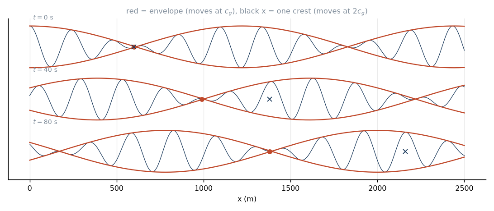

# 2. Group velocity, or why the ocean sorts its waves

The dispersion relation gives us two speeds, not one, and the difference
between them is the most important fact in this project.

## The obvious speed

A crest is a place where $kx-\omega t$ is constant. Differentiate: the crest
moves at

$$c = \frac{\omega}{k} = \sqrt{\frac{g}{k}\tanh kh},$$

which in deep water is

$$c = \sqrt{g/k} = \frac{g}{\omega} = \frac{gT}{2\pi}.$$

Longer period, faster crest, linearly. A 20 s wave does 31 m/s; a 5 s wave does
7.8. Fine. This is the speed you would measure by watching one crest and timing
it.

But it is not the speed at which anything gets anywhere.

## Two waves

Do the simplest thing that can possibly show the effect. Add two waves of equal
amplitude and nearly equal wavenumber, $k\pm\Delta k$ and $\omega\pm\Delta\omega$:

$$\eta = a\cos\big[(k+\Delta k)x - (\omega+\Delta\omega)t\big]
       + a\cos\big[(k-\Delta k)x - (\omega-\Delta\omega)t\big].$$

Use $\cos A + \cos B = 2\cos\frac{A+B}{2}\cos\frac{A-B}{2}$:

$$\eta = \underbrace{2a\cos(\Delta k\,x - \Delta\omega\,t)}_{\text{envelope}}
        \times \underbrace{\cos(kx-\omega t)}_{\text{carrier}}. \tag{2.1}$$

A fast little wave, modulated by a slow big one. The carrier moves at
$\omega/k$. The envelope moves at $\Delta\omega/\Delta k$, and in the limit of
nearby wavenumbers that is

$$\boxed{\ c_g = \frac{d\omega}{dk}\ }$$

Equation (2.1) is worth keeping. It is not a toy: it is *literally a set of
waves*, two swells beating against each other, and we come back to it in
lesson 7 when we ask why waves arrive in groups. Everything about sets is
already in that line.

## The same thing, properly

Two waves is suggestive; a packet is convincing. Build one out of a narrow band
of wavenumbers with amplitude $A(k)$ concentrated near $k_0$:

$$\eta(x,t) = \int A(k)\,e^{i(kx-\omega(k)t)}\,dk.$$

Expand the phase about $k_0$:

$$kx - \omega(k)t = \underbrace{k_0x-\omega_0t}_{\text{carrier}}
+ (k-k_0)\big[x - \omega'(k_0)t\big]
- \tfrac12(k-k_0)^2\omega''(k_0)t + \cdots$$

so

$$\eta \approx e^{i(k_0x-\omega_0t)}
\int A(k)\,e^{i(k-k_0)[x-\omega'(k_0)t]}\,dk .$$

The integral depends on $x$ and $t$ only through the combination
$x-\omega'(k_0)t$. That is the definition of a shape travelling at
$\omega'(k_0)$. The envelope moves at $c_g=d\omega/dk$; the carrier inside it
moves at $\omega_0/k_0$. And the third term, the one with $\omega''$, is what
makes the packet spread as it goes — dispersion in the narrow sense. We will
need it in lesson 8.

## The factor of one half

Differentiate $\omega=\sqrt{gk}$:

$$c_g = \frac{d\omega}{dk} = \frac12\sqrt{\frac{g}{k}} = \frac{c}{2}.$$

In deep water, energy travels at **half** the speed of the crests.

I want to make sure this lands, because it is genuinely peculiar. Watch a group
of swell lines move across a bay. The group creeps along at $c_g$. But the
individual crests inside it are moving at $2c_g$, which means they are
overtaking their own group. A crest is born at the *back* of the group, where
the envelope is small, grows as it marches forward through the group, reaches
full height in the middle, shrinks as it passes to the front, and dies. Then
another is born at the back. The waves run through the group like a conveyor,
twice as fast as the group itself, each one living for only as long as it takes
to traverse it.

You can watch this happen. Find a group of swell, pick a crest at the back, and
follow it. It will die before it gets to the front.



For general depth,

$$c_g = \frac{d\omega}{dk} = \frac{c}{2}\left[1 + \frac{2kh}{\sinh 2kh}\right]
\equiv nc,$$

with $n$ going from $1/2$ in deep water to $1$ in shallow water. So in shallow
water the group and the crests travel together — no dispersion, no conveyor,
nothing to sort. The prism only works in deep water. Fortunately, deep water is
where the ocean mostly is.

## Why $c_g$ is the speed that matters

Because it is the speed energy travels at. Let us check that rather than assert
it.

**Potential energy**, per unit surface area, relative to still water:

$$E_p = \frac1L\int_0^L\int_0^\eta \rho g z\,dz\,dx
= \frac1L\int_0^L \tfrac12\rho g\eta^2\,dx
= \tfrac12\rho g a^2\langle\cos^2\rangle = \tfrac14\rho g a^2.$$

**Kinetic energy**: grind $\frac12\rho|\nabla\phi|^2$ through the potential
(1.7), integrate over depth and average over a wavelength. The hyperbolic
integrals are tedious and the answer is clean:

$$E_k = \tfrac14\rho g a^2.$$

Equal to $E_p$. Equipartition, as in every other linear oscillator you have
met. So

$$E = \tfrac12\rho g a^2 = \tfrac18\rho g H^2, \tag{2.2}$$

with $H=2a$ the crest-to-trough height. Note $H^2$: doubling the wave height
quadruples the energy. A 4 m wave is not twice a 2 m wave, it is four times it.

**Flux.** The rate at which one column of water does work on the next is the
dynamic pressure times the horizontal velocity, integrated over depth and
averaged over a period:

$$\mathcal F = \int_{-h}^{0}\overline{p_{\rm dyn}\,u}\;dz.$$

Both $p_{\rm dyn}$ and $u$ come from (1.7), both carry a $\cosh k(z+h)$, and the
integral produces exactly the combination $n$:

$$\boxed{\ \mathcal F = E\,c_g\ } \tag{2.3}$$

Energy density times group velocity. So $c_g$ is not just the speed of a
mathematical envelope; it is the speed at which the ocean actually moves
energy. Equation (2.3) is the conservation law we will use to shoal waves in
lesson 9, and its deep-water form is what carries swell across the Pacific in
lesson 5.

## What this buys us

Put the two deep-water results together:

$$c_g = \frac{g}{4\pi f} = \frac{gT}{4\pi}. \tag{2.4}$$

Energy transport speed is proportional to period. Now imagine a storm that
radiates 20 s and 10 s waves at the same instant. The 20 s energy travels at
15.6 m/s, the 10 s energy at 7.8. After 4000 km the first has arrived and the
second is still two and a half days out.

That is the sorting. It is not subtle, it is not a small correction, and it is
the reason a beach ever sees a clean line of swell. The ocean is a
Fourier analyser several thousand kilometres long, and the output tape is the
sea state at your local buoy.

## Numbers to check

```
c_g(20 s) = 9.80665 * 20 / (4 pi) = 15.61 m/s = 56.2 km/h
10,000 km / 15.61 m/s = 640,600 s = 7.41 days
```

A 2 m wave carries $E = 1025\times9.81\times4/8 = 5.0$ kJ/m². At $c_g=11.7$ m/s
that is 59 kW per metre of crest. A kilometre of beach receives about 59
megawatts, continuously, from a modest two-metre swell. The ocean is not
messing about.

---

*Next: how the wind gets energy into the water in the first place.*
