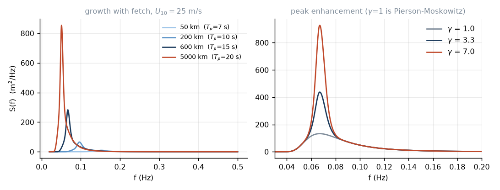
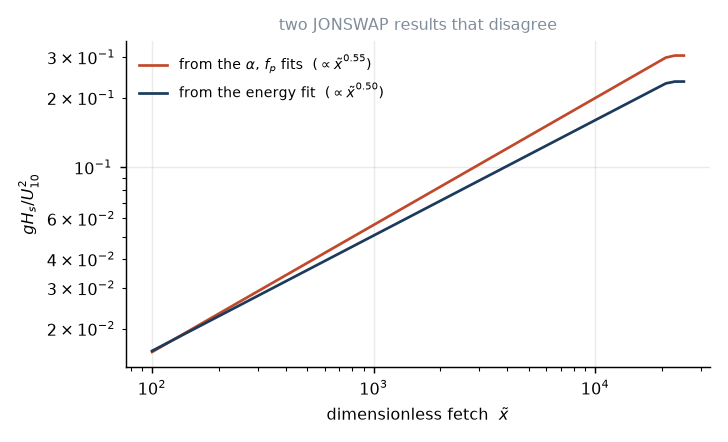

# 4. The spectrum

A storm sea has no wavelength. Look at one and you cannot point to a period,
because there isn't one — there are thousands, superposed. So we stop trying to
describe individual waves and describe the *distribution* instead.

## Variance density

Take a record of the surface elevation $\eta(t)$ at one point. It is a random
signal with zero mean. Everything we care about — how big the waves are, how
long they are, whether they come in sets — is contained in how its variance is
distributed across frequency.

Define $S(f)$ so that $S(f)\,df$ is the contribution to $\mathrm{var}(\eta)$
from the band $[f, f+df]$. Units: m²/Hz. Then

$$m_n \equiv \int_0^\infty f^n S(f)\,df$$

are the spectral moments, and $m_0 = \mathrm{var}(\eta)$ is the total variance.

Almost every number a surfer or an engineer quotes is a moment in disguise:

$$H_{m0} = 4\sqrt{m_0},
\qquad
\bar f = \frac{m_1}{m_0},
\qquad
\nu = \sqrt{\frac{m_0m_2}{m_1^2}-1}.$$

The first is the **significant wave height**. The 4 looks arbitrary and is not:
in lesson 7 we will show that for a narrow-band sea the wave heights are
Rayleigh distributed, and the mean of the highest third of them comes out at
$4.004\sqrt{m_0}$. The definition was reverse-engineered from an old convention
— $H_{1/3}$ was what experienced observers estimated by eye — so that the
spectral quantity and the eyeball quantity would agree. They do, to a tenth of
a percent, which is a nice piece of luck.

The last one, $\nu$, measures how narrow the spectrum is. It is zero for a pure
sine and grows as the spectrum broadens. Hold that thought; we will need it in
lesson 7, and we will also find that it has a defect.

## The fully developed sea

Blow a steady wind over an unlimited ocean for an unlimited time. The sea grows
until input balances dissipation and then stops. Pierson and Moskowitz (1964)
went looking for this state in North Atlantic weather-ship records, found
storms that seemed to have reached it, and fitted

$$S_{\rm PM}(f) = \frac{\alpha g^2}{(2\pi)^4 f^5}
\exp\left[-\frac54\left(\frac{f_p}{f}\right)^4\right],
\qquad \alpha = 0.0081,\quad f_p = \frac{0.13\,g}{U_{10}}. \tag{4.1}$$

The structure is worth reading rather than just accepting. The $f^{-5}$ is
Phillips's equilibrium tail: above the peak, waves are as steep as they can be
before breaking, and dimensional analysis with only $g$ available gives
$S\propto g^2f^{-5}$. The exponential cuts off the low-frequency side, because
waves longer than the peak have not been built yet. And $f_p\propto 1/U_{10}$
says the stronger the wind, the longer the waves — as Miles's cutoff demanded.

One consequence, easily checked: integrating (4.1) gives

$$H_s \approx 0.0246\,U_{10}^2$$

with $U$ in m/s. A 20 m/s wind, blowing forever over an infinite ocean, makes
10 m seas and no more. That is the ceiling.

## Fetch and duration

Real storms do not blow forever over an infinite ocean. Two things limit them.

**Fetch** $F$: the distance of open water the wind crosses. Waves at the
downwind edge have had $F/c_g$ to grow; at the upwind edge, nothing.

**Duration** $t$: how long the wind blows. Even with unlimited fetch, a wave
that has only had six hours cannot be as developed as one that has had three
days.

The Joint North Sea Wave Project — a hundred-odd wave recorders strung 160 km
downwind from Sylt, measuring through 1968 and 1969 — was built to pin the
fetch dependence down. What came out (Hasselmann et al. 1973) was that the
spectrum keeps the PM shape but gains a sharper peak, and that the parameters
scale with the dimensionless fetch

$$\tilde x = \frac{gF}{U_{10}^2}.$$

The spectrum is (4.1) multiplied by a Gaussian bump sitting on the peak:

$$S_{\rm J}(f) = S_{\rm PM}(f)\cdot\gamma^{\,r(f)},
\qquad
r(f)=\exp\left[-\frac{(f-f_p)^2}{2\sigma^2f_p^2}\right],
\qquad
\sigma=\begin{cases}0.07 & f\le f_p\\ 0.09 & f>f_p\end{cases} \tag{4.2}$$

with

$$f_p = 3.5\,\frac{g}{U_{10}}\,\tilde x^{-0.33},
\qquad
\alpha = 0.076\,\tilde x^{-0.22},
\qquad
\gamma = 3.3. \tag{4.3}$$

The peak enhancement $\gamma$ is the new physics: a young sea under active
forcing has a much sharper peak than a mature one, because the wind is pumping
one narrow band and the four-wave interaction has not had time to spread it
out. Setting $\gamma=1$ recovers Pierson–Moskowitz exactly.

Treat $\gamma=3.3$ as an average, not a constant. The individual JONSWAP storms
scattered between about 1 and 7.



For duration limiting, invert the growth curve $\tilde t = 68.8\,\tilde x^{0.67}$
with $\tilde t = gt/U_{10}$, to get the fetch a wind of that duration has had
time to exploit:

$$F_{\rm eff} = \frac{U_{10}^2}{g}\left(\frac{gt}{68.8\,U_{10}}\right)^{1.4925}.$$

Whichever of fetch, duration, and full development gives the smallest effective
$\tilde x$ is the one that binds. Full development kicks in at
$\tilde x = 2.16\times10^4$, obtained by setting (4.3) equal to the PM value
$f_pU/g=0.13$. Beyond that the sea does not grow no matter what you do, and any
code that lets it is wrong.

## An inconsistency, and a choice

Now a problem, and it is not a small one.

JONSWAP produced three separate regressions: one for $\alpha$, one for $f_p$,
and one for the total energy, usually written
$\varepsilon = g^2m_0/U^4 = 1.6\times10^{-7}\,\tilde x$, equivalently

$$\frac{gH_s}{U_{10}^2} = 1.6\times10^{-3}\,\tilde x^{1/2}. \tag{4.4}$$

They are three independent fits through scattered field data, and **they do not
agree with each other.**

Watch. Integrating the PM shape gives
$m_0 = \alpha g^2/\!\left[5(2\pi)^4f_p^4\right]$, times about 1.52 for the
$\gamma=3.3$ bump. Substituting (4.3):

$$m_0 \propto \frac{\alpha}{f_p^4}
\propto \frac{\tilde x^{-0.22}}{\tilde x^{-1.32}} = \tilde x^{1.10}
\qquad\Longrightarrow\qquad
\frac{gH_s}{U^2} = 1.26\times10^{-3}\,\tilde x^{0.55}.$$

Compare with (4.4): $1.6\times10^{-3}\tilde x^{0.50}$. Different coefficient,
different exponent. The two agree only at $\tilde x\approx 120$, which is below
the range JONSWAP was fitted over at all. At $\tilde x = 10^4$ — a perfectly
ordinary storm — the spectral route gives a significant height **24% higher**
than the energy law.

This is not anyone's algebra error. It is what happens when you fit three
quantities separately to noisy data and nobody checks that they close.

We resolve it by trusting (4.4) and rescaling the spectrum to match, because
$m_0$ is the quantity that was measured most directly and it is the one that
must be right if the simulator is to produce believable wave heights. The shape
stays JONSWAP; only the level moves. `swells.spectra.storm_spectrum` does this
by default and reports the factor; pass `calibrate=False` to see the raw
discrepancy.

The test `test_the_two_jonswap_fits_disagree_and_we_know_by_how_much` pins the
ratio down, including the prediction that it scales as $\tilde x^{0.05}$ — the
difference of the two exponents. It does, to within half a percent, which is
reassuring: the diagnosis is right, and it is not a coincidence of coefficients.



Mention this to anyone who quotes JONSWAP numbers at you with four significant
figures.

## Direction

So far $S(f)$: energy against frequency, summed over all directions. But a
storm radiates over a fan of headings, and which part of that fan points at you
determines everything about whether you get any swell at all.

Write $S(f,\theta)=S(f)D(f,\theta)$ with $\int D\,d\theta = 1$, and take the
standard form

$$D(f,\theta) \propto \cos^{2s}\!\left(\frac{\theta-\bar\theta}{2}\right),$$

where large $s$ means a narrow beam. Mitsuyasu et al. (1975) found $s$ peaks at
the spectral peak and falls off either side:
$s = s_{\max}(f/f_p)^{5}$ below the peak, $s_{\max}(f/f_p)^{-2.5}$ above it.

So the peak of the spectrum is the most directional part, and the tail is
nearly isotropic. That makes sense: the long waves at the peak were built by
the wind and remember which way it was blowing; the short chop is stirred by
everything.

Typical $s_{\max}$ is around 10 for an actively forced wind sea and 25–75 for
old swell, which has had the whole ocean to sort itself out. Lesson 6 explains
why the sorting happens.

## The defect in $\nu$

One warning, because it caught us.

$m_2$ weights the integrand by $f^2$, and the JONSWAP tail goes as $f^{-5}$, so
the $m_2$ integrand decays only as $f^{-3}$. That converges, but slowly — and
it means $\nu$ depends noticeably on where you truncate the spectrum. Going
from a cutoff of $3f_p$ to $25f_p$ moves $\nu$ by 30%, and it has still not
settled.

Worse, a JONSWAP is nearly self-similar in $f/f_p$, so on a fixed frequency
grid what $\nu$ actually measures is $f_{\max}/f_p$. An old sea, with a low
peak, has more octaves of tail inside the grid and therefore reports a
*larger* $\nu$ than a young one — the opposite of what you meant.

So do not use $\nu$ as a bandwidth without saying where you cut. In lesson 7 we
will need a narrowness measure for the grouping calculation and we will use a
different one, $\kappa$, which is weighted by $S$ rather than $f^2S$ and moves
by less than one percent over the same range of cutoffs.

## Numbers

$U_{10}=25$ m/s over 600 km of fetch:

```
x~     = 9.81 * 6e5 / 25^2   = 9414
f_p    = 3.5*(9.81/25)*9414^-0.33 = 0.0670 Hz  ->  T_p = 14.9 s
alpha  = 0.076 * 9414^-0.22       = 0.01015
H_s    = 0.0016 * sqrt(9414) * 625/9.81 = 9.89 m
```

Ten-metre seas with a fifteen-second peak. That is a serious storm, and it is
the one we will send across the ocean in the next lesson.

---

*Next: the ocean as a prism.*
