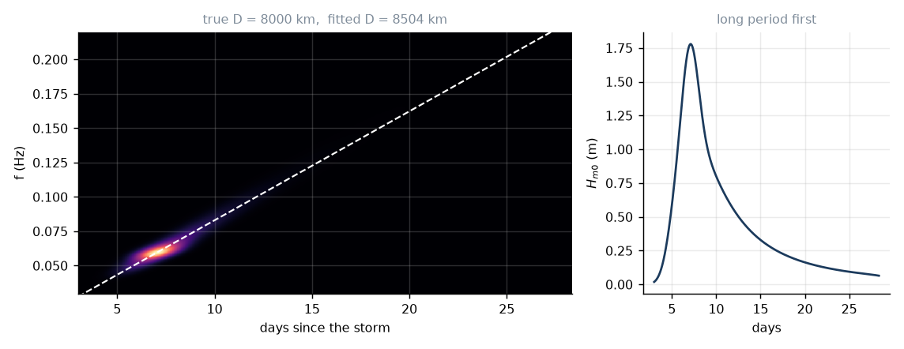

# 5. The great sorting

This is the good one.

## The setup

A storm has made the spectrum of lesson 4: broad, messy, ten metres high,
energy spread over periods from four seconds to eighteen. Now the wind stops,
or the swell runs out from under it, and all three source terms in the action
balance switch off. No input, no whitecapping, no meaningful nonlinear
transfer. Equation (3.4) collapses to pure transport:

$$\frac{\partial N}{\partial t} + \mathbf c_g\cdot\nabla N = 0.$$

Each frequency component just goes, in a straight line, at its own group speed,
forever. And in deep water that speed is

$$c_g(f) = \frac{g}{4\pi f}.$$

That is all the physics there is in this lesson. Everything else is
consequences, and the consequences are lovely.

## Arrival time

A component of frequency $f$ crossing a distance $D$ arrives after

$$\boxed{\ t(f) = \frac{D}{c_g(f)} = \frac{4\pi D}{g}\,f\ } \tag{5.1}$$

Linear in $f$. Not $f^2$, not something with a $\tanh$ in it — a straight line
through the origin. Invert it and you have the frequency arriving at time $t$:

$$f(t) = \frac{g}{4\pi D}\,t. \tag{5.2}$$

So an observer at range $D$ sees the swell arrive **longest period first**, with
the period shortening steadily as the days pass. The rate is

$$\boxed{\ \frac{df}{dt} = \frac{g}{4\pi D}\ } \tag{5.3}$$

Put a buoy in the water, record for a week, compute a spectrum every hour,
stack them into a spectrogram. What you see is a straight bright ridge climbing
from low frequency to high. Its slope is (5.3).

## What the ridge tells you

Now turn it round, because this is the part that should make you sit up.

The slope of that ridge depends on **nothing but the distance to the storm.**
Not the wind speed. Not the fetch. Not how big the waves were, or which
direction they came from, or how long the storm lasted. Just $D$.

So measure the slope and read off the distance:

$$D = \frac{g}{4\pi\,(df/dt)}. \tag{5.4}$$

And extrapolate the ridge back to $f=0$: that intercept is the moment the storm
radiated, because $t=0$ in (5.1) is when everything left. A single instrument,
bobbing in the water off California, tells you that six days ago there was a
storm 9,300 km away, and roughly when it blew.

This is not a thought experiment. Walter Munk and Frank Snodgrass did it, and
the way they did it is one of the great experiments in geophysics.

## The Pacific experiment

In 1963 Snodgrass, Munk and colleagues laid a chain of pressure recorders
across the entire Pacific: New Zealand, Tutuila in Samoa, Palmyra, Honolulu,
Yakutat in Alaska, and a station off California. Nearly a great-circle line,
spanning something like 10,000 km.

Southern Ocean storms below New Zealand radiate swell north. The chain caught
each event at station after station, and at every one the spectrogram showed
the ridge. Same storm, different distance, different slope — shallower the
further away you were, exactly as (5.3) says.

Two results came out of it, and both are startling.

The first is that it works at all. Fit the ridge at Honolulu and you locate a
storm thousands of kilometres away in the Southern Ocean to within a few
hundred kilometres. Linear wave theory, derived for a flat bottom and small
amplitudes, tracks energy across a third of the planet and gets the answer
right.

The second is more surprising: **the swell barely decayed.** Once you correct
for geometric spreading — the fan of rays widening as it goes — the remaining
attenuation over the whole Pacific was small enough to be hard to measure. Deep
ocean swell, it turns out, is nearly lossless. That is lesson 6.

## What actually arrives

Real storms are not points and do not radiate for an instant, so the arrival at
a given time is not a single frequency but a narrow band. Two things smear it.

**Duration.** If the storm blew for $T_{\rm storm}$, each frequency keeps
arriving for that long, and by (5.2) a spread in time is a spread in frequency:

$$\Delta f_{\rm dur} = \frac{g}{4\pi D}\,T_{\rm storm}.$$

**Size.** The storm has a width, so its near and far edges are at different
ranges and the same frequency arrives over a window of $F/c_g$, contributing

$$\Delta f_{\rm size} = f\,\frac{F}{D}.$$

Here $F$ is the fetch, doing double duty. The fetch is the distance the wind
blows over water, so it is *also* the width of the patch that is radiating at
you — the storm cannot be smaller than the runway it gave the wind. Tying the
two together is not free: it assumes the storm sits still. A low that tracks
along with its own waves keeps forcing them long after they should have run out
from underneath it, and its effective fetch can exceed its width. Forecasters
call that trapped fetch, and it is how some of the largest recorded seas were
made. We do not model it, so read $F$ here as "how big the storm is".

Together:

$$\Delta f(t) \approx \frac{g\,T_{\rm storm}}{4\pi D} + \frac{Ff}{D}. \tag{5.5}$$

Both terms fall off as $1/D$. **The further you are from the storm, the cleaner
the swell.** That single line explains why Hawaii gets those absurd, glassy,
perfectly periodic lines from Aleutian storms 4,000 km away, and why a beach
sitting under its own local gale gets slop. Distance is a filter, and the ocean
charges nothing to run it.

The model in `swells.propagate.spectrogram` is exactly this: put each
frequency's energy where (5.1) says it goes, smeared over the window (5.5),
attenuated by the spreading of lesson 6. It is kinematic — it transports what
the storm made without re-solving the source terms — and lesson 6 explains why
that is defensible.

There is one more thing (5.5) does to the energy. A frequency's variance was
radiated over a time $T_{\rm storm}$ and arrives spread over
$\Delta T_{\rm eff} = T_{\rm storm} + F/c_g$, so the spectral *density* drops
by $T_{\rm storm}/\Delta T_{\rm eff}$ even before any energy is lost. Dispersion
does not stretch a single frequency — all its energy travels at one speed — so
this stretching comes entirely from the source having finite extent.



## Doing it

Here is the inverse problem, run for real, in
`tests/test_propagate.py::test_the_inverse_problem_recovers_the_storm`:
synthesise the spectrogram for a storm at a known 8,000 km, fit the ridge with
a weighted least squares, invert (5.4), and see what comes back. It recovers
the distance to better than 5% and the origin time to better than 5% of the
transit. From a picture of a wiggly line.

```python
from swells.propagate import spectrogram, spectrogram_ridge, fit_chirp, distance_from_chirp
S_ft  = spectrogram(f, S_source, D, storm_duration, storm_radius, t)
ridge = spectrogram_ridge(f, S_ft)
df_dt, t0 = fit_chirp(t, ridge, weights=Hm0_t**2)
print(distance_from_chirp(df_dt) / 1e3, "km")
```

## Numbers

A storm 4,000 km away with a 14.9 s peak:

```
c_g at the peak  = 9.80665 / (4 pi * 0.0670)  = 11.64 m/s
peak arrives     = 4.0e6 / 11.64 = 343,600 s  = 95.4 h = 3.98 days
chirp slope      = 9.80665 / (4 pi * 4.0e6)   = 1.951e-7 Hz/s
                                              = 0.01686 Hz/day
```

Six mHz per day. Over a four-day event the peak period slides from about 20 s
down to about 12 s. If you have ever watched a swell "drop off" over several
days while simultaneously getting shorter and weaker, you have watched
equation (5.2) happen.

And the pocket check: a 20 s wave at 15.6 m/s covers 10,000 km in 7.4 days.

---

*Next: how much of it survives, and the surprising answer that it is nearly all
of it.*
