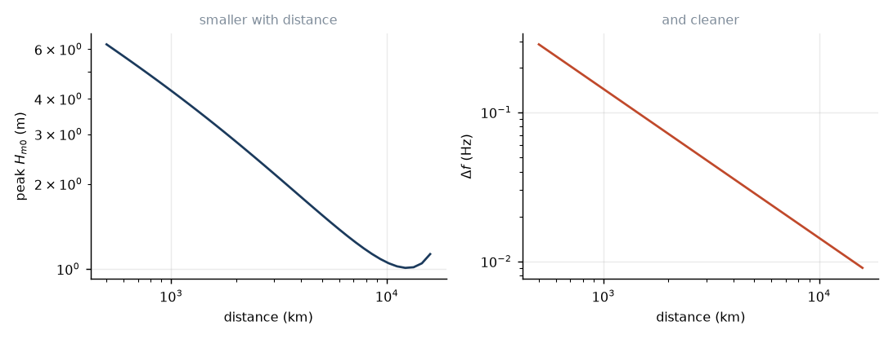

# 6. What survives

Ten-metre seas leave the storm. One-and-a-half-metre lines arrive at the beach.
Where did the other 97% of the energy go?

Almost none of it was destroyed. Nearly all of it went somewhere else.

## Spreading

A storm radiates into a fan of directions. Follow a narrow wedge of that fan,
of angular width $d\theta$. On a flat Earth the wedge occupies an arc of length
$D\,d\theta$ at range $D$. Energy flux through the wedge is conserved — nothing
is lost, it is just spread thinner — so

$$E\cdot D\,d\theta = \text{const}
\qquad\Longrightarrow\qquad
E \propto \frac1D,
\qquad
a \propto \frac{1}{\sqrt D}.$$

Amplitude falls off as the square root of distance. Go four times as far, get
half the wave. Note that this is *not* dissipation: the energy is still in the
ocean, just aimed at a wider stretch of coastline.

The Earth is not flat, and over these distances that matters. Great circles
from a point converge again on the far side of the sphere, so the correct arc
length is $R\sin(D/R)$ and

$$E(D) \propto \frac{1}{R\sin(D/R)}. \tag{6.1}$$

For $D\ll R$ this is the flat-Earth $1/D$ — at 2,000 km the correction is 1.3%.
But past a quarter of the way round the planet, $\sin(D/R)$ starts *decreasing*
and the swell begins to reconverge. Energy that has spread out for 10,000 km
starts focusing back together for the next 10,000.

This is real, and it is why the antipode of a Southern Ocean storm can receive
more swell than somewhere closer to it. It is the same effect as the Pacific
chain of lesson 5 seeing usable swell in Alaska from storms below New Zealand.

## Narrowing

The other thing distance does is clean the swell up, in two separate senses.

*In frequency*, by equation (5.5): the arriving bandwidth falls as $1/D$.

*In direction*, by simple geometry. A storm one fetch $F$ across, seen from
distance $D$, subtends an angle $F/D$. A 600 km storm seen from 500 km fills
69° of your horizon, and its swell arrives from all over that arc, crossing at
angles. Seen from 10,000 km the same storm subtends 3.4°, and every ray
reaching you is essentially parallel.

So a beach 10,000 km from a storm gets swell that is narrow-band in frequency
*and* narrow in direction. Long crests, all parallel, all the same period.
That is the definition of groundswell, and it is manufactured entirely by
distance.

There is a trade you cannot escape here. The same journey that makes the swell
clean makes it small — $1/\sqrt D$ from spreading, plus the temporal stretching
of lesson 5. Perfect lines and size are geometrically opposed. Every surfer
knows this without knowing why.



## Dissipation, and Snodgrass's surprise

Now the interesting question: how much energy is actually *lost*?

Candidate mechanisms, and why each one fails to matter:

**Viscosity.** For a viscous fluid the amplitude of a deep-water wave decays
with a rate $2\nu k^2$. Put in $\nu=10^{-6}$ m²/s and $k=0.018$ m$^{-1}$ for a
15 s swell: the e-folding time is about $10^9$ seconds, or thirty years. Over a
week-long crossing this is nothing. The reason is $k^2$ — viscosity punishes
short waves ferociously and long waves not at all.

**Bottom friction.** Only acts where the wave feels the bottom, which in deep
ocean it does not. Matters on the continental shelf, and then a lot.

**Breaking.** Swell steepness in the open ocean is around 0.01. Breaking needs
0.44. Not a chance.

**Nonlinear transfer.** Fourth order in a small quantity, and it conserves
energy anyway — it can reshape the spectrum but not remove it.

Adding these up, deep ocean swell should be nearly lossless. And this is what
Snodgrass and Munk found. After correcting for spreading, the residual
attenuation across the whole Pacific was so small they had trouble measuring
it — a few percent, for waves near the spectral peak.

Think about what that means. A wave leaves the Southern Ocean, travels a third
of the way round the Earth over eight days and ten thousand kilometres, and
arrives having lost a few percent of its energy. There is no other wave
phenomenon in nature that propagates this well.

## Where it does get lost

Honesty requires two footnotes.

Snodgrass's result is cleanest for the swell peak. For the shorter components
there is measurable extra decay, and the mechanism was argued about for
forty years. Ardhuin and co-workers, using satellite altimetry to track
individual swell fields across whole ocean basins, showed the loss is real,
frequency-dependent, and probably due to friction in the *air* boundary layer
above the swell — the swell moving faster than the wind above it, and paying
for the privilege. The size of the effect is still debated, and operational
models carry a tunable swell-dissipation term whose coefficient is fitted, not
derived.

Second, swell running against a strong current loses badly. Wave action, not
energy, is conserved when currents are present (lesson 3), and an opposing
current shortens the wavelength and steepens the wave until it breaks. This is
what makes the Agulhas notorious. We do not model currents here, which is a
real limitation and not a small one.

## The budget

For the default simulation — 25 m/s, 600 km fetch, 4,000 km away:

```
in the storm            H_s = 9.9 m
after spreading and
temporal stretching     H_s = 1.8 m
```

A factor of five and a half in height, so a factor of 30 in energy. And essentially all of
it is geometry: the wedge got wider, and the packet got longer. Almost nothing
was actually destroyed.

The ocean is not lossy. It is just very large.

---

*Next: the lesson this project was built for.*
