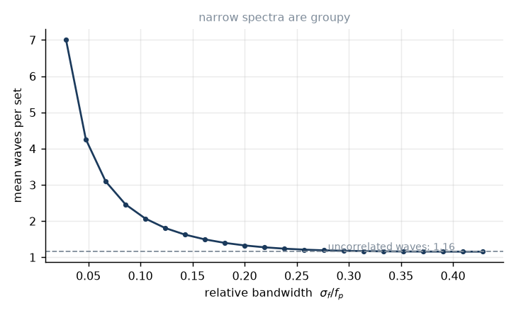
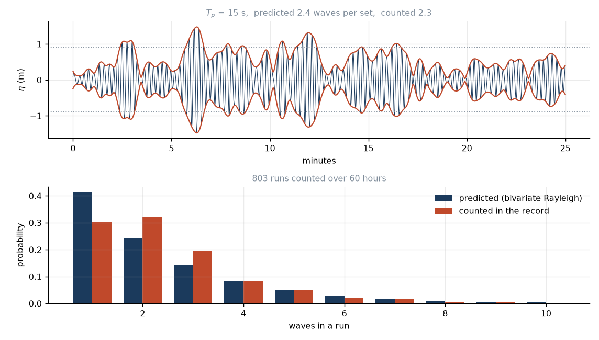

# 7. Why waves come in sets

You sit on a board for four minutes and nothing happens. Then three good waves
arrive in ninety seconds. Then nothing again.

This is not luck, and it is not the storm pulsing. The storm has been dead for
a week. It is a property of what a narrow band of frequencies does when you add
it up, and we already derived it in lesson 2 without noticing.

## Two waves is already a set

Go back to equation (2.1). Two waves, slightly different frequencies:

$$\eta = \underbrace{2a\cos\big[\pi(f_1-f_2)t\big]}_{\text{envelope}}
\;\cos\big[\pi(f_1+f_2)t\big].$$

The envelope goes through a full cycle in

$$T_{\rm beat} = \frac{1}{|f_1-f_2|}.$$

Put numbers in. Suppose the swell contains 14 s and 15 s components — a
perfectly ordinary spread for a groundswell.

$$T_{\rm beat} = \frac{1}{1/14 - 1/15} = 14\times15 = 210\ \text{s} = 3.5\
\text{minutes}.$$

Three and a half minutes. That is the set interval, and we got it from two
cosines and no oceanography at all.

Notice what controls it: the *difference* of the frequencies, not their values.
A narrow band gives a long beat. And lesson 5 told us that distance narrows the
band — $\Delta f \propto 1/D$. So swell from far away has long, lazy,
well-defined sets, and local windswell has none. The prism does not just clean
the swell, it manufactures the sets.

## From two lines to a band

Real swell is not two frequencies, it is a continuum. Write it as a sum with
random phases:

$$\eta(t) = \sum_j a_j\cos(\omega_jt+\varepsilon_j),
\qquad \varepsilon_j \sim \mathcal U[0,2\pi),$$

with $a_j = \sqrt{2S(f_j)\Delta f}$ so that each band contributes its share of
the variance. This is what `swells.synth.surface_elevation` builds, by inverse
FFT.

Now suppose the band is narrow, centred on $\bar\omega$. Factor the carrier out:

$$\eta(t) = u_c(t)\cos\bar\omega t - u_s(t)\sin\bar\omega t
= R(t)\cos\big[\bar\omega t + \theta(t)\big]$$

with

$$u_c = \sum_j a_j\cos\big[(\omega_j-\bar\omega)t+\varepsilon_j\big],
\qquad
u_s = \sum_j a_j\sin\big[(\omega_j-\bar\omega)t+\varepsilon_j\big].$$

Because the band is narrow, $\omega_j-\bar\omega$ is small, so $u_c$ and $u_s$
vary slowly compared with the carrier. They are the envelope
$R=\sqrt{u_c^2+u_s^2}$ and the phase.

(In practice you extract $R$ from a record with a Hilbert transform: the
analytic signal $\eta + i\mathcal H[\eta]$ has modulus $R$. That is
`swells.groups.envelope`.)

## The envelope is Rayleigh

Here is where it becomes statistics.

$u_c$ and $u_s$ are each a sum of many terms with independent random phases. By
the central limit theorem they are Gaussian. They have equal variance $m_0$,
and they are uncorrelated. So the joint density is a circular Gaussian:

$$p(u_c,u_s) = \frac{1}{2\pi m_0}\exp\left[-\frac{u_c^2+u_s^2}{2m_0}\right].$$

Go to polar coordinates $u_c=R\cos\theta$, $u_s=R\sin\theta$, remembering the
Jacobian $R$, and integrate out the phase:

$$\boxed{\ p(R) = \frac{R}{m_0}\exp\left[-\frac{R^2}{2m_0}\right]\ } \tag{7.1}$$

The Rayleigh distribution. It came out of nothing but "add up many things with
random phases", which is why it turns up everywhere from radar to radio fading.

For a narrow-band sea a wave's height is twice the local envelope, $H\approx 2R$,
so

$$p(H) = \frac{2H}{H_{\rm rms}^2}\exp\left[-\frac{H^2}{H_{\rm rms}^2}\right],
\qquad H_{\rm rms}=\sqrt{8m_0}, \tag{7.2}$$

and the exceedance probability is beautifully simple:

$$P(H > H_*) = \exp\left[-\frac{H_*^2}{H_{\rm rms}^2}\right]
= \exp\left[-2\left(\frac{H_*}{H_{m0}}\right)^2\right]. \tag{7.3}$$

**Where the 4 comes from.** Promised in lesson 4. The mean of the highest third:
set $P(H>H_*)=1/3$, so $H_*=H_{\rm rms}\sqrt{\ln 3}$, then

$$H_{1/3} = 3\int_{H_*}^{\infty}H\,p(H)\,dH = 1.416\,H_{\rm rms}
= 1.416\sqrt{8m_0} = 4.00\sqrt{m_0}.$$

So $H_{m0}=4\sqrt{m_0}$ is not a convention pulled from the air; it is
$H_{1/3}$, and it is Rayleigh's fault that the number is 4.

The rest of the family, all fixed by $H_{m0}$ alone:

| | ratio to $H_{m0}$ |
|---|---|
| mean | 0.626 |
| rms | 0.707 |
| $H_{1/3}$ | 1.000 |
| $H_{1/10}$ | 1.272 |
| $H_{1/100}$ | 1.668 |

That last row is worth internalising. On a "two metre" day the biggest wave in
a couple of hours is about 3.3 m. The forecast is not lying to you; you are
reading the wrong statistic.

## But this is not yet a set

Equation (7.2) tells you *how many* big waves there are. It says nothing about
whether they arrive together — and that is the entire question. Shuffle the
waves into a random order and the height distribution is unchanged, but the
sets are gone.

Grouping is about **sequence**, so we need the correlation between one wave and
the next.

Define $\kappa$ as the correlation of the complex envelope at a lag of one mean
period:

$$\kappa = \frac{1}{m_0}\left|\int_0^\infty S(f)\,
e^{-2\pi i (f-\bar f)\bar T}\,df\right|,
\qquad \bar T = \frac{m_0}{m_1}. \tag{7.4}$$

Read it as a Fourier transform of the spectrum evaluated at one wave period. A
narrow spectrum has a wide transform, so $\kappa\to1$: the envelope barely
changes from one wave to the next, and big waves come in company. A broad
spectrum gives $\kappa\to0$ and no memory at all.

Two remarks. Take the *modulus* of the complex integral — writing only the
cosine part, as some references do, throws away the sine term and underestimates
$\kappa$ for asymmetric spectra. And note that $\kappa$ is weighted by $S$, not
$f^2S$: unlike the bandwidth $\nu$ of lesson 4, it does not care about the
high-frequency tail. Over cutoffs from $3f_p$ to $25f_p$, $\nu$ moves 30% and
$\kappa$ moves 0.6%. That is why the grouping calculation uses $\kappa$.

## How many waves in a set

Now the model, due to Kimura (1980).

Call a wave "big" if it exceeds a threshold $H_c$, conventionally $H_{m0}$. A
set is a run of consecutive big waves. If successive normalised heights
$x = H/H_{\rm rms}$ follow a bivariate Rayleigh distribution with parameter
$\kappa$,

$$p(x_1,x_2) = \frac{4x_1x_2}{1-\kappa^2}\,
I_0\!\left(\frac{2\kappa x_1x_2}{1-\kappa^2}\right)
\exp\left[-\frac{x_1^2+x_2^2-2\kappa x_1x_2}{1-\kappa^2}\right], \tag{7.5}$$

then the probability that a big wave is followed by another is

$$p_{22} = \frac{P(x_1>x_c\ \text{and}\ x_2>x_c)}{P(x_1>x_c)}
= \frac{\displaystyle\int_{x_c}^\infty\!\!\int_{x_c}^\infty p(x_1,x_2)\,dx_1dx_2}
{e^{-x_c^2}}. \tag{7.6}$$

No closed form; `swells.groups.p22` does the double integral numerically.
(Check (7.5) at $\kappa=0$: $I_0(0)=1$ and the exponent separates, so it
factorises into two independent Rayleighs, as it must.)

The model is Markov — whether wave $j{+}1$ is big depends on wave $j$ and
nothing earlier — so run lengths are geometric:

$$P(j) = p_{22}^{\,j-1}(1-p_{22}),
\qquad
\boxed{\ \bar j = \frac{1}{1-p_{22}}\ } \tag{7.7}$$

**The null case.** At $\kappa=0$, $p_{22}=e^{-x_c^2}=e^{-2}=0.135$ and
$\bar j = 1.16$. Uncorrelated waves produce "sets" of 1.16 waves — that is, no
sets. Any real grouping has to beat 1.16, and that is the number to compare
against before getting excited.

**The set interval.** A cycle is one run plus the lull after it. In a stationary
sea the fraction of waves that are big is $q=e^{-x_c^2}$, and all the big ones
live inside the runs, so a full cycle is $\bar j/q$ waves long:

$$T_{\rm set} = \frac{\bar j\,\bar T}{q}. \tag{7.8}$$



## The verdict on the seventh wave

Everyone has heard that waves come in sets of seven. Let us see.

Run the numbers for clean groundswell — the default simulation, 15 s swell that
has crossed 4,000 km:

```
kappa            0.86
waves per set    2.4   (predicted)
                 2.4   (counted in a one-hour synthetic record)
set interval     4.4 min
```

Under two and a half. Not seven. And that is for genuinely clean swell; a mixed sea
gives less. The folklore is wrong as stated.

But it is not wrong by accident, and here is where it comes from.

Take the threshold $H_c=H_{m0}$, the natural definition of a wave worth
catching. The fraction of waves exceeding it is, by (7.3),

$$q = e^{-2} = 0.1353
\qquad\Longrightarrow\qquad
\frac1q = e^2 = 7.39.$$

**One wave in 7.4 exceeds the significant height.** Not "waves come in sevens" —
"roughly every seventh wave is a big one". That is a true statement, it falls
straight out of the Rayleigh distribution, and the number $e^2$ is as close to
seven as folklore has any right to be.

So the tradition preserved a real quantity and mislabelled it. The seven is the
spacing between good waves, not the size of the bunch.

## Two swells

One more mechanism, because it produces the longest and most obvious sets of
all.

If two storms are running — say a 16 s groundswell and a 10 s windswell — the
spectrum is bimodal and the beat between the two peaks is

$$T_{\rm beat} = \frac{1}{1/10 - 1/16} = 26.7\ \text{s},$$

which is short and messy. But two groundswells of 15 s and 16 s from different
storms give

$$T_{\rm beat} = 240\ \text{s} = 4\ \text{minutes},$$

a slow, powerful pulse where the two swells march in and out of step. When
people talk about a day having "long intervals between huge sets", this is
usually what is happening, and you can see it directly in the buoy spectrum as
two separate peaks.

## Checking it

The claim of this lesson is falsifiable, so we falsify it. Two independent
routes to waves-per-set:

1. **Theory.** From the spectrum: compute $\kappa$ by (7.4), $p_{22}$ by (7.6),
   $\bar j$ by (7.7). No time series involved.
2. **Counting.** Synthesise a forty-hour record with random phases, split it
   into waves at zero up-crossings, mark the ones over $H_{m0}$, count the runs.
   No distribution theory involved.

`tests/test_groups.py::test_predicted_and_counted_run_lengths_agree` runs both
at three different bandwidths and demands they agree within 15%. They do.

This test is not decoration. The research draft this project was built from had
a `p22` of the form `kappa**1.5 + (1-kappa**1.5)*exp(-2)` — a plausible-looking
interpolation with no derivation behind it. It gives the right answer at the
endpoints and the wrong answer everywhere in between, and nothing but a test
like this would have caught it.



Look closely at the histogram, though, because there is a systematic
discrepancy and it is telling you something. The geometric law predicts too
many runs of length 1 (0.40 against a counted 0.30) and too few of length 2 and
3. The means agree; the shapes do not, quite.

That is the Markov assumption failing. Equation (7.7) assumes wave $j{+}1$
depends only on wave $j$, but a real envelope is smooth — it has memory
stretching over several waves, not one. So once a group has started it is more
likely to continue than a one-step model can express, and genuine
single-wave "sets" are rarer than predicted. The effect is modest and it
cancels out of $\bar j$, which is why the mean survives.

Fixing it means abandoning the geometric distribution and modelling the
envelope process directly. Longuet-Higgins (1984) does this, treating the
envelope as a continuous random process and asking how long it stays above a
level. It is a better model and a much longer derivation, and for our purposes
the mean is what we wanted.

---

*Next: what happens when the groups get steep enough to feed themselves.*
