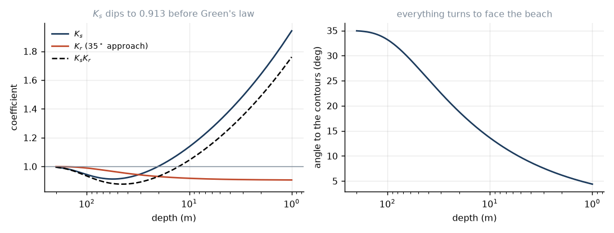

# 9. Feeling the bottom

For a week the swell has not known the bottom exists. Now it does.

The moment $kh$ stops being large, three things happen at once: the wave slows
down, it turns, and it grows. All three follow from the dispersion relation and
one conservation law, and none of them require new physics.

## The frequency is the one thing that does not change

Start with what stays fixed. A wave train arriving at a fixed rate must leave at
the same rate — crests cannot pile up somewhere in between — so $\omega$ is
constant as the wave shoals. Everything else adjusts.

From $\omega^2 = gk\tanh kh$ with $\omega$ fixed and $h$ falling, $\tanh kh$
falls, so $k$ must rise. Rising $k$ means:

$$L = \frac{2\pi}{k}\ \downarrow,
\qquad
c = \frac{\omega}{k}\ \downarrow.$$

Shorter and slower. A 15 s swell that is 351 m long and doing 23 m/s in deep
water is 144 m long and doing 9.6 m/s in 10 m of water, and 47 m long doing
3.1 m/s in 1 m.

## Shoaling

Now for the height. Between deep water and breaking there is nothing to
dissipate energy, so the energy flux of equation (2.3) is conserved along the
path of the wave:

$$E_0c_{g,0}b_0 = E(x)\,c_g(x)\,b(x),$$

where $b$ is the width between neighbouring wave rays. Take $b$ constant for
the moment (waves arriving straight on) and use $E=\tfrac18\rho gH^2$:

$$H = H_0\underbrace{\sqrt{\frac{c_{g,0}}{c_g}}}_{K_s}. \tag{9.1}$$

The **shoaling coefficient**. It is nothing but a statement that if the energy
slows down, it has to bunch up.

$K_s$ does something slightly odd on the way in. In deep water $c_g = c/2$; in
shallow water $c_g = c$. So as the wave enters intermediate depth, $c_g$
briefly *increases* — the factor $n$ climbing from $1/2$ towards $1$ outruns the
falling $c$ — and the wave gets **smaller**. $K_s$ dips to a minimum of about
0.913 around $kh\approx1.2$. Only after that does the falling $c$ take over and
$K_s$ climb, eventually as

$$K_s \propto h^{-1/4},$$

which is Green's law. The dip is real and measurable, though a metre of swell
losing 9% of its height on the way over the shelf is not something you would
notice from the beach.

`tests/test_nearshore.py::test_shoaling_conserves_energy_flux` checks (9.1)
against a directly computed $Ec_g$ at six depths, to one part in $10^6$. That
is the one test in the whole suite that is checking a conservation law rather
than a formula, and it is the one I would trust most.

## Refraction

Now let the wave arrive at an angle.

Depth varies along the crest. Where the water is shallower the wave is slower.
So one end of the crest lags, and the crest pivots. This is refraction, and it
is Snell's law — the same law, for the same reason, with $c$ in place of
$1/n$:

$$\frac{\sin\theta}{c} = \text{const}
\qquad\Longrightarrow\qquad
\sin\theta(x) = \frac{c(x)}{c_0}\sin\theta_0. \tag{9.2}$$

As $h\to0$, $c\to0$, so $\theta\to0$: **every wave ends up nearly parallel to
the shore**, no matter how obliquely it started. A swell that arrives at 45° in
deep water is down to 12° by the time it is in 10 m. This is why beaches almost
never see waves coming in sideways, and why you have to look carefully to tell
which way a wave is going to peel.

Refraction also changes the height, because turning the crests changes the
spacing between rays. Geometry gives $b_0/b = \cos\theta_0/\cos\theta$, so

$$K_r = \sqrt{\frac{\cos\theta_0}{\cos\theta}}, \qquad H = H_0K_sK_r. \tag{9.3}$$

Since $\theta<\theta_0$ always, $K_r<1$: oblique waves lose height. The energy
that was in your stretch of coast has been spread along the beach.

**Headlands and bays.** Over real bathymetry $b$ does interesting things. Off a
headland the contours bulge seaward, rays converge from both sides, $b$
shrinks, and the wave grows. In a bay the contours retreat, rays diverge, and
the wave shrinks. This is why points break bigger than the beach next to them
on the same swell, and why the corner of the bay is always smaller. It is not
about exposure; it is about ray focusing.

**And where it breaks down.** If rays converge hard enough they cross. At the
crossing point $b\to0$ and (9.3) says $K_r\to\infty$: an infinite wave. That is
a **caustic**, and it is a failure of the ray approximation, not a real
prediction — exactly as in optics, where geometrical optics also predicts
infinite intensity at a focus and wave optics does not. Over a submarine canyon
or a sharp reef you need a phase-resolving model (mild-slope or Boussinesq),
and a 1-D transect like ours will not see it coming.

## The mean surface tilts

One more effect, less obvious and more consequential than it looks.

Waves carry momentum, and the flux of that momentum is the **radiation stress**
(Longuet-Higgins & Stewart 1964):

$$S_{xx} = E\left[n(1+\cos^2\theta) - \tfrac12\right].$$

As the wave shoals, $E$ and $n$ change, so $S_{xx}$ changes, and a gradient of
momentum flux is a force. Something has to balance it, and the only thing
available is a slope in the mean water level. Cross-shore momentum balance:

$$\frac{dS_{xx}}{dx} + \rho g(h+\bar\eta)\frac{d\bar\eta}{dx} = 0. \tag{9.4}$$

**Outside the surf zone**, shoaling makes $E$ rise, so $S_{xx}$ rises, and
(9.4) forces $\bar\eta$ down:

$$\bar\eta = -\frac{H^2k}{8\sinh 2kh}. \tag{9.5}$$

This is **set-down**: the mean sea surface dips slightly under the shoaling
waves. It is small, a few centimetres.

**Inside the surf zone**, everything reverses. Breaking destroys $E$ fast, so
$S_{xx}$ falls steeply and $\bar\eta$ must climb. Substituting the depth-limited
relation $H=\gamma_b(h+\bar\eta)$ into (9.4) gives a constant slope:

$$\frac{d\bar\eta}{dx} = \frac{\tan\beta}{1 + \dfrac{8}{3\gamma_b^2}}. \tag{9.6}$$

For $\gamma_b=0.78$ the factor is 0.186: the water level climbs at about a fifth
of the beach slope. This is **set-up**, and it is not small. A 3 m breaker on a
1:50 beach piles up 30–40 cm of extra water at the shoreline, on top of the
tide. Coastal engineers care about (9.6) a great deal, and it is one of the
reasons big-swell events flood things that the tide table said were safe.

The same mechanism, applied to the *alongshore* component $S_{xy}$, drives the
longshore current — the one that quietly moves you two hundred metres down the
beach while you are not looking.

## Assumptions, stated

All of the above assumes a **mild slope**: the depth changes slowly enough over
a wavelength that the wave can adjust and be treated as locally periodic. The
condition is roughly $|\nabla h|/kh \ll 1$.

On a steep reef this fails. Some of the wave reflects, evanescent modes appear,
and the wave arrives at the break without having equilibrated — which is
precisely why reef breaks throw so much harder than beach breaks at the same
size. Our model will get the height about right and the violence quite wrong.

---

*Next: the crest outruns the wave.*
