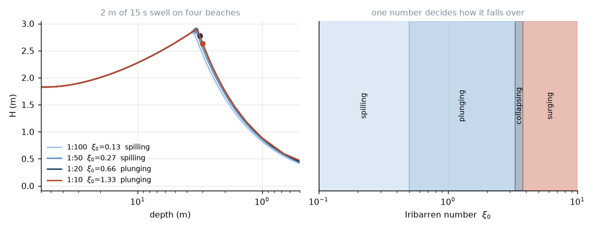

# 10. Breaking

Shoaling makes the wave taller and shorter at the same time. Both push the
steepness up, and steepness cannot rise forever. At some point the wave falls
over.

## The condition

The physical statement is simple: a wave breaks when the water at the crest
moves forward faster than the crest itself.

$$u_{\rm crest} \ge c.$$

Below that, water circles in orbits and the shape moves through it. Above it,
the fluid at the crest is no longer in orbit — it has left, and it is now a
projectile. The wave stops being a wave and becomes a lump of water in mid-air.

Everything that follows is an attempt to turn that clean statement into a
number, and every attempt is partly empirical.

## Deep water: Stokes

Stokes solved the limiting case in 1880. A steady progressive wave of maximum
height has a corner at the crest, with an enclosed angle of exactly $120°$.
(You can get the $120°$ from a local analysis: at the corner the flow must be
stagnant in the wave frame, and the free-surface condition then fixes the
opening angle. It is a lovely little argument and entirely local — the angle
does not care about wavelength or depth.)

The corresponding steepness is

$$\left(\frac{H}{L}\right)_{\max} \approx 0.142 = \frac{1}{7},
\qquad (ka)_{\max}\approx0.443. \tag{10.1}$$

One in seven. A deep-water wave cannot be steeper than that. In practice ocean
swell is nowhere near — steepness 0.01 or so — which is exactly why lesson 6
found nothing to dissipate.

## Any depth: Miche

Miche (1944) generalised (10.1) by the obvious interpolation:

$$H_{\max} = 0.142\,L\tanh kh. \tag{10.2}$$

In deep water $\tanh\to1$ and we recover Stokes. In shallow water
$\tanh kh\to kh = 2\pi h/L$, and the $L$ cancels:

$$H_{\max} \to 0.142\times2\pi\times h = 0.892\,h.$$

The steepness limit has quietly become a **depth** limit. In shallow water it
does not matter how long your wave is; it can only be so tall for the water it
is standing in.

That is the single most useful fact about surf. The wave breaking in front of
you is about as tall as the water is deep. If it is head high, you are standing
in roughly head-deep water — which, if you have ever tried to walk out through
a shorebreak, you already knew.

## The breaker index, and how much it varies

Define

$$\gamma_b = \frac{H_b}{h_b},$$

the ratio of breaker height to breaking depth. Miche gives 0.892. McCowan's
solitary-wave analysis (1894) gives **0.78**, and that is the number in every
textbook.

But measured $\gamma_b$ ranges from about 0.6 to 1.3, and the biggest single
control is the beach slope. On a steep beach the wave runs out of water faster
than it can react and carries further before collapsing, so $\gamma_b$ goes up.
Goda (2010) fitted

$$\gamma_b = 0.17\frac{L_0}{h_b}
\left\{1 - \exp\left[-1.5\pi\frac{h_b}{L_0}
\left(1 + 15\tan^{4/3}\beta\right)\right]\right\}, \tag{10.3}$$

which reduces to about 0.8 on a flat bed and climbs with slope. We use
$\min$(Miche, Goda), which is a standard pragmatic choice and not a principle.

Be clear about what is going on here: 0.78 is not a constant of nature. It is a
round number from an idealised solitary wave, and the honest statement is
"$\gamma_b$ is somewhere between 0.6 and 1.3 and depends mostly on slope".

## Four ways to fall over

Now the good part. Waves do not all break the same way, and which way is
decided by a single dimensionless number.

$$\boxed{\ \xi_0 = \frac{\tan\beta}{\sqrt{H_0/L_0}}\ } \tag{10.4}$$

the **Iribarren number**, or surf similarity parameter. Look at what it
compares: the slope of the beach, against the steepness of the wave. Two
slopes, one ratio. That is all.

The physical question it answers is *how much beach the wave has to work with*.
A steep wave on a gentle beach has a long way to travel while breaking; a flat
wave on a steep beach hits the shore all at once.

| $\xi_0$ | type | what happens |
|---|---|---|
| $<0.5$ | **spilling** | Foam appears at the crest and cascades down the face. The wave stays roughly symmetric and dissipates gradually over a wide surf zone. Gentle beaches, steep short-period wind swell. |
| $0.5$–$3.3$ | **plunging** | The face goes vertical, the crest throws forward over an air pocket, and the whole lip lands in the trough. Violent, localised, and the reason anybody surfs. |
| $3.3$–$3.8$ | **collapsing** | The face steepens and the lower part collapses without a proper barrel. |
| $>3.8$ | **surging** | The wave never overturns. It surges up the beach face and drains back like a standing wave. Steep beaches and long flat swell. Almost all the energy reflects. |

Two warnings. The boundaries are conventional and different authors quote
0.4–0.5 and 3.0–3.3; nothing changes discontinuously in the real ocean. And
$\xi_0$ uses the *deep-water* height and wavelength, which makes it a property
of the swell-plus-beach combination rather than of the wave at the moment it
breaks.

The trend is what to remember. Long-period swell has small $H_0/L_0$, so long
period pushes $\xi_0$ **up**: the same beach that spills a 6 s windswell will
plunge a 16 s groundswell. Every surfer knows long-period swell breaks harder.
Equation (10.4) is why.



## Peeling

One last thing, and it is the difference between a wave you can ride and a wave
you cannot.

Refraction (lesson 9) leaves the crest at a small angle $\theta_b$ to the
shoreline. If $\theta_b=0$ the entire crest reaches breaking depth
simultaneously and the wave breaks all at once — a **closeout**. If
$\theta_b>0$, one end reaches breaking depth first and the break travels
sideways along the crest at the peel speed

$$c_{\rm peel} = \frac{c_b}{\sin\theta_b}.$$

Small $\theta_b$ means fast peel. A surfer has to keep up with the breaking
point, so there is a window: too small an angle and it is unmakeable, too large
and it is slow and gutless. The good spots are the ones whose bathymetry
happens to hold $\theta_b$ in that window for a long way.

Which is what a point break is. The bathymetry is arranged so that the wave
meets breaking depth progressively along a line, holding the peel angle nearly
constant for hundreds of metres. It is not that the waves are better there; the
same swell closes out on the beach next door. It is that the bottom is shaped to
keep the crest at the right angle.

## Numbers

Our default 15 s swell, 1.8 m in deep water, arriving 30° off a 1:50 beach:

```
L0     = 351 m
xi_0   = 0.02 / sqrt(1.79/351) = 0.28   ->  spilling
breaks in h = 2.9 m,  H_b = 2.47 m,  gamma_b = 0.85
peel angle 7 deg
```

Spilling and gentle, because 1:50 is a flat beach. Put the same swell on a 1:12
reef and $\xi_0 = 1.2$: plunging. Same ocean, same wave, different bottom — and
that is the whole of surf-spot geography in one number.

---

*Next: one storm, end to end, with numbers.*
