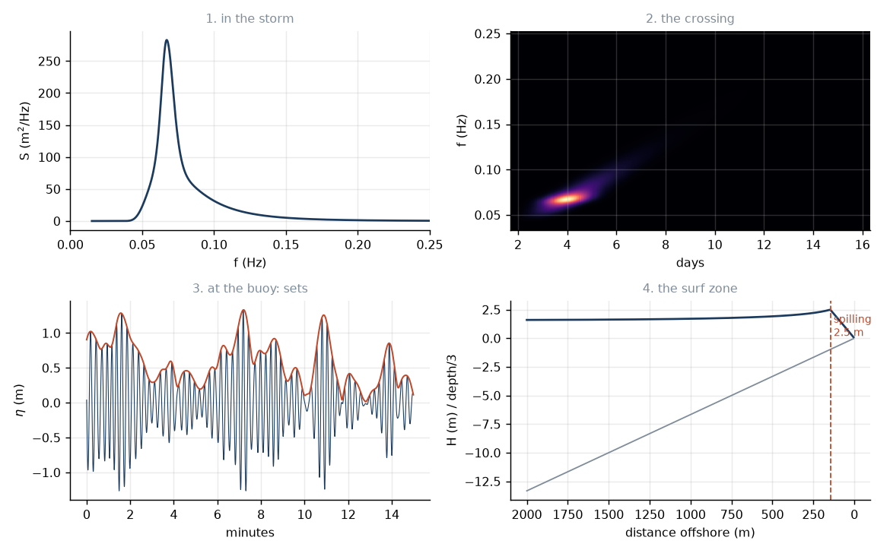

# 11. The whole chain

Ten lessons of pieces. Now one storm, end to end.

## A Southern Ocean low

Thirty metres a second of wind, over 1200 km of open water, for two days — so
the generating area is 1200 km across too. The target is a reef in Indonesia,
9000 km away, with a 1:25 bottom, and the swell arrives 20° off the contours.

```python
from swells import Storm, Coast, run, surf_report
print(surf_report(run(
    storm=Storm(U10=30, fetch_km=1200, duration_h=48, distance_km=9000),
    coast=Coast(slope=0.04, approach_deg=20))))
```

### 1. Generation (lesson 4)

$$\tilde x = \frac{gF}{U_{10}^2} = \frac{9.81\times1.2\times10^6}{900} = 13{,}080$$

Fetch-limited — the wind blew long enough to use all of its fetch, but the
fetch ran out before full development at $\tilde x = 2.16\times10^4$. So

$$f_p = 3.5\frac{g}{U}\tilde x^{-0.33} = 0.0501\ \text{Hz},
\qquad T_p = 20.0\ \text{s},
\qquad H_s = 16.8\ \text{m}.$$

Sixteen-metre seas. Note the period: a 20 s wave has $c = 31$ m/s, which is
faster than the 30 m/s wind that made it. Miles's mechanism cannot have done
that — the wave is outrunning its own forcing. This is the four-wave transfer
of lesson 3 walking the peak downhill into periods the wind could never reach
directly. Without it there would be no groundswell and no surfing.

### 2. The crossing (lessons 5 and 6)

$$c_g = \frac{g}{4\pi f_p} = \frac{9.81}{4\pi\times0.0501} = 15.6\ \text{m/s}$$

$$t = \frac{9\times10^6}{15.6} = 5.8\times10^5\ \text{s} = 6.7\ \text{days}$$

The simulator says the peak lands at 6 d 17 h. The swell fills in on day 4.4,
with the longest components — 25 s and up, too small to notice but arriving
first — and builds for two and a half days.

The chirp:

$$\frac{df}{dt} = \frac{g}{4\pi D} = 7.5\ \text{mHz/day}.$$

Half the rate of the 4000 km example, because the distance is more than
doubled. Over the week-long event the peak period slides from about 25 s down
to 15 s. That slide *is* the signature — it is how you would know, from the
buoy alone, that this came from 9000 km away and not from 3000.

And the size:

```
in the storm     16.8 m
at the buoy       3.1 m
```

A factor of 5.4 in height, 29 in energy — nearly all of it geometry. The wedge
spread and the packet stretched; almost nothing was dissipated.

### 3. The sets (lesson 7)

$$\nu = 0.077, \qquad \kappa = 0.893$$

Very narrow, very correlated, because it has come a very long way.

```
waves per set    2.7  (predicted)
                 3.2  (counted)
set interval     6.7 min
```

Three-wave sets, seven minutes apart. That is a lot of sitting and waiting, and
it is precisely what people mean when they say a swell has "long lulls". Compare
the 4000 km case: 2.4 waves, 4.4 minutes. Compare a local gale from 400 km:

```
T_p = 9.6 s,  nu = 0.168,  kappa = 0.675
waves per set   1.6
set interval    1.8 min
```

1.6 waves per set is barely above the uncorrelated baseline of 1.16. Windswell
does not really come in sets at all — it just comes.

And the biggest wave in an hour: $1.67\times3.1 = 5.19$ m, against a "3.1 m"
forecast. This is why reading the significant height as "how big the waves are"
gets people hurt.

### 4. The surf (lessons 9 and 10)

$$L_0 = \frac{gT^2}{2\pi} = 620\ \text{m},
\qquad
\xi_0 = \frac{0.04}{\sqrt{3.11/620}} = 0.56.$$

Plunging. It breaks in 5.0 m of water at 4.4 m high, with $\gamma_b = 0.88$, at
a peel angle of 4°.

Now change one thing and nothing else. Put the identical swell on a 1:50 beach:
$\xi_0 = 0.28$, spilling. Same ocean, same storm, same wave — mush instead of
barrels. The bottom is doing all the work, and equation (10.4) says so in one
line.

## Running it backwards

The forward problem is a simulation. The inverse problem is the one you can do
with real data, and it is more fun.

You have a buoy record. You do not know where the storm was. Compute a spectrum
every hour, stack them into a spectrogram, fit the ridge:

```python
from swells.propagate import spectrogram_ridge, fit_chirp, distance_from_chirp
ridge = spectrogram_ridge(f, S_ft)
df_dt, t0 = fit_chirp(t, ridge, weights=Hm0_t**2)
print(distance_from_chirp(df_dt) / 1e3, "km away")
print(t0 / 86400, "days ago")
```


Two numbers off a straight line: how far, and how long ago. The test in
`tests/test_propagate.py` recovers 8000 km to within 5%.

This is what Snodgrass and Munk did across the Pacific in 1963, and it is still
how you check whether a forecast model has put a storm in the right place.

## What we left out

An honest list, because a model you cannot criticise is not a model.

**Currents.** The largest omission. Wave–current interaction Doppler-shifts
frequencies, refracts rays, and can steepen a swell into breaking against an
opposing flow. This is why action, not energy, is the conserved quantity in
lesson 3 — and we then went and used energy anyway, because we assumed no
currents. On a route crossing the Agulhas or the Gulf Stream this would be
wrong in an important way.

**Real bathymetry.** We shoal over a plane beach. Reality has canyons,
headlands and reefs, which focus and defocus swell by factors of two and
produce the caustics of lesson 9 that a 1-D transect cannot see. This is most
of what makes one spot better than the next.

**Breaking as a process.** We stop the wave at the depth limit and hold it
there. A real surf zone dissipates progressively; Battjes & Janssen (1978) model
it properly by tracking the fraction of waves broken. Our version gets the
breaker height about right and the surf zone width quite wrong.

**Infragravity waves.** Lesson 8 described the long wave bound to each group and
released at the break. We compute a scaling for it and nothing more. On a
gentle beach in a big swell it can dominate the run-up.

**The source terms in transit.** Lesson 5 switches off $S_{\rm in}$,
$S_{\rm nl}$ and $S_{\rm ds}$ the moment the swell leaves the storm. Lesson 6
argues this is nearly right and Snodgrass measured that it is nearly right, but
"nearly" is doing real work over 9000 km, and the modern swell-dissipation
literature is not settled.

**Second-order wave shape.** Real waves have peaked crests and flat troughs.
All our statistics assume a Gaussian sea, which is symmetric. Crest heights in
reality run above Rayleigh, systematically.

**Nonlinear shoaling.** As the wave steepens, linear theory becomes exactly the
wrong tool, and it is worst precisely where the interesting things happen.

None of these change the story of this course. The storm still makes a
spectrum, the ocean still sorts it, the sorting still makes sets, and the
bottom still decides how it breaks. They change the numbers, sometimes by a
lot, and they are where you would go next.

## The chain in one picture



Spectrum, crossing, sets, surf. Every panel drawn by
`figures/make_figures.py` from the same code that the lessons derive.

## And the one number

$$c_g = \frac{gT}{4\pi}$$

Everything in eleven lessons hangs off that. A 20 s wave does 56 km/h. Long
waves get there first. That is why the ocean sorts itself, why swell arrives
clean, why it arrives in sets, and why a storm nobody saw, a week ago, on the
other side of the planet, is the reason there are lines on the horizon this
morning.
